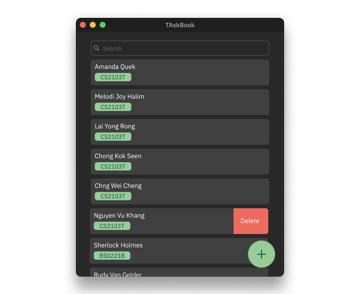

# TAskbook

TAskbook is a **CLI tool designed for Teaching Assistants** to streamline communication and administrative tasks. It simplifies communication, reduces manual searching, and ensures organized record-keeping, enabling TAs to quickly retrieve, update, and manage student contacts without navigating cluttered spreadsheets or emails.

### Key Features:
- Enables quick retrieval, updating, and management of student contacts.
- Designed for efficient CLI interaction, minimizing the need for spreadsheets or emails.
- Written in **OOP fashion**, providing a well-structured and maintainable codebase.
- Comes with **comprehensive user and developer documentation**.

### Project Background:
TAskbook is based on the **AddressBook-Level3** project created by the [SE-EDU initiative](https://se-education.org). It builds upon the existing project to better serve the needs of Teaching Assistants.

For detailed documentation, refer to the **[TAskbook Product Website](https://ay2425s2-cs2103-f15-1.github.io/tp/)**.
