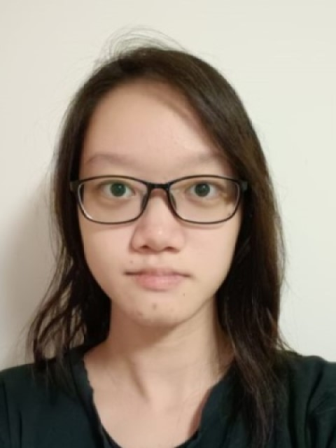
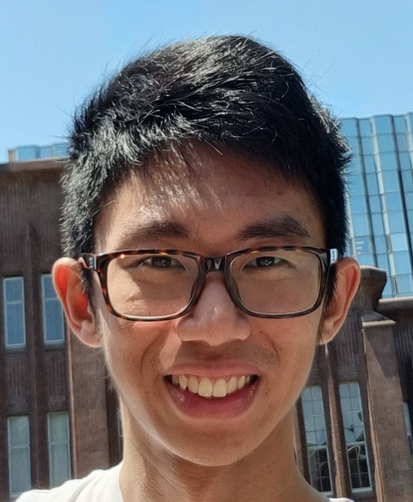
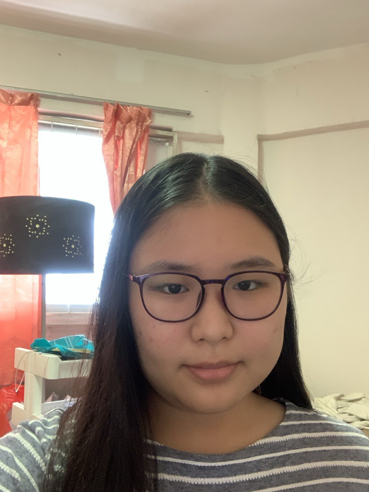
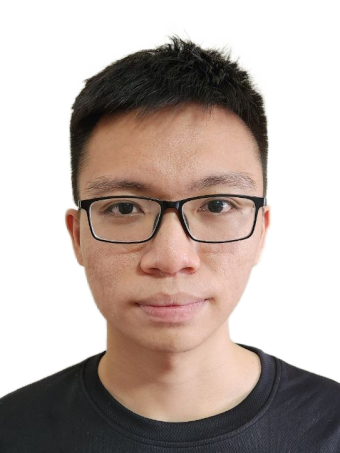
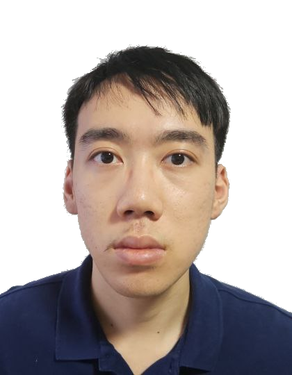

We are a team based in the [School of Computing, National University of Singapore](https://www.comp.nus.edu.sg).

You can reach us at the email `seer[at]comp.nus.edu.sg`

## Project team

### Melodi Joy Halim

[[github](https://github.com/meloppeitreet)]
[[portfolio](team/meloppeitreet.md)]

* Role: Developer
* Responsibilities: Testing

### Chong Kok Seen

[[homepage](http://www.comp.nus.edu.sg/~kokseen1)]
[[github](https://github.com/kokseen1)]

* Role: Developer
* Responsibilities: Code quality

### Amanda Quek Yan Ling

[[github](https://github.com/Victoria281)]
[[homepage](https://nus-csm.symplicity.com/profiles/amanda.quek)]
[[portfolio](team/victoria281.md)]

* Role: Developer
* Responsibilities: Documentation

### Lai Yong Rong

[[homepage](http://www.comp.nus.edu.sg/~laiyr)]
[[github](https://github.com/WhyAre)]

* Role: Developer
* Responsibilities: Integration

### Nguyen Vu Khang

[[website](https://www.nguyenvukhang.com)]
[[github](https://github.com/nguyenvukhang)]

* Role: Developer
* Responsibilities: Git expert

### Chng Wei Cheng

[[homepage](http://www.comp.nus.edu.sg/~cwc099)]
[[github](https://github.com/AnAfterthought)]
[[portfolio](team/anafterthought.md)]

* Role: Developer
* Responsibilities: Deliverables and deadlines

